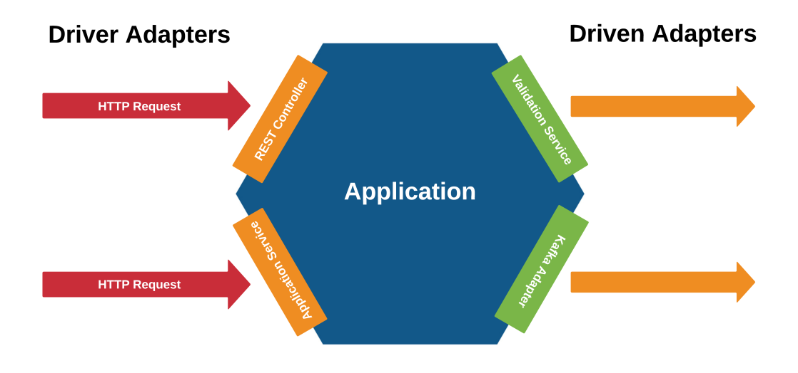

# Arq. Hexagonal | Ports and Adapters

>"Allow an application to equally be driven by users, programs, automated test or batch scripts, and to be developed and tested
>in isolation from its eventual run-time devices and databases" - Cockburn

O termo "arquitetura" hexagonal está muito mais ligado com decisões de design de software do que necessariamente de arquitetura. 

