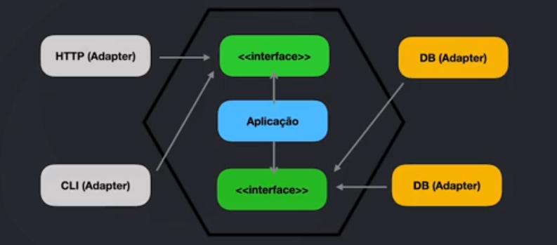

# Ports and Adapters

- Definição de limites e proteção nas regras da aplicação;

- Componentization e desacoplamento;
  - Logs;
  - Cache;
  - Upload;
  - Banco de dados;
  - Filas;
  - Componentes;

- Facilidade na quebra para microsserviços;

## Lógica básica

## DIP - Dependency Inversion Principle

- Módulos de alto nível não devem depender de módulos de baixo nível. Ambos devem depender de abstrações;
- Abstrações não devem depender de detalhes. Detalhes devem depender de abstrações;